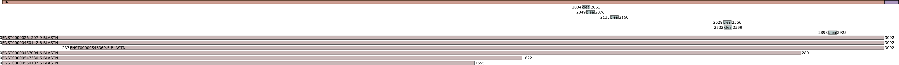

# Genotate automatic annotation pipeline for transcriptomic sequences

Many bioinformatics tools exist to annotate reconstructed transcripts but are too complex to use for non–bioinformaticians. 
We have developed a platform to automatically annotate large sets of transcriptomic sequences. 
Annotations can be inferred based on their similarities with reference annotated sequences. 
Annotations can also be inferred based on structure and domains of protein sequences.
Genotate is available on [Genotate Website](http://www.genotate.life).

We provide an interactive and intuitive web platform, named Genotate, which allow to search and visualize this identified annotations.
Genotate web platform can be installed on a server, follow the instruction on [Github](https://github.com/tchitchek–lab/genotate.web).

# Table of Contents

1. [Introduction](#Introduction)
2. [Installation requirements](#Installation)
3. [Installation of Genotate](#Installation)
4. [How to run Genotate](#Genotate)
5. [Output files](#Output)

# <a name="Introduction"> 1. Introduction</a>

Genotate unifies ORF identification, similarity annotation and functional annotation in an automatic annotation platform.
Genotate provides to biologist the possibility to annotate transcript sequence and entire transcriptome.


## Identification of ORF

Genotate is able to identify for each reconstructed transcript all the ORF.
To search for a peptidic functional domain it is necessary to know the encoded protein sequence. The open reading frame needs to be identified on the transcript sequence and then translated to obtain the protein.
A reading frame characterized a sequence of nucleotides divided into a set of consecutive, non–overlapping triplets.
To simplify the representation, only one frame and it's reverse is taken into account in the example below.
The sequence contains 3 frames and their reverse, and each one can contain multiple ORF.
An ORF is on a frame, begins with a Start codon initiating the translation and end with a Stop codon terminating the translation.

For each reconstructed transcript, Genotate firstly identifies the sets of all possible ORFs. ORF with a length under a threshold can be filtered, to avoid interpretations of sequences with no biological meaning. The start and stop codons, which initiate and end the ORF, can be specified by users. By default, start codon is set to ‘ATG’ and stop codons to ‘TAG, TGA, TAA’. The ORFs can be identified in both strands of the reconstructed transcripts. Inner ORFs which consist of nested ORF sequences, can also be identified as well as outside ORF which consists of sequences lacking either the start or stop codon.

The following figure represents the diversity of ORF.
An ORF can begin at every start codon which has a stop codon in the same frame.


ORF 2 and 6 are complete ORF which includes the inner ORF 1, 4  and 5. The ORF 3 and 7 are incomplete and characterized as outside ORF.

## Identification of similarity annotations

Genotate annotate sequences based on the similarity to other reference sequences.

The similarity annotations are computed based on any set of reference sequences specified by the user. The similarity annotations are identified at both the nucleic and peptidic levels. Sequences similarities are identified with the BLAST algorithm. Similarity results can be filtered based on the identity percentage. Similarity results can also be filtered based on the query sequence cover percentage and subject sequence cover percentage. The descriptions associated with the matched sequences are available in the similarity results computed by Genotate.

<table>
  <tr style="font–weight: bold;">
    <td style="width:10%">Name</sub></td>
    <td style="width:80%">Information</sub></td>
    <td style="width:10%">Link</sub></td>
  </tr>
  <tr>
    <td><sub>Ensembl</sub></td>
    <td><sub>Genome, transcriptome(cds, cdna, ncrna) and proteome for a large number of species</sub></td>
    <td><sub><a href='http://www.ensembl.org/index.html'>Link</a><sub></td>
  </tr>
  <tr>
	<td><sub>NCBI</sub></td>
	<td><sub>Genome, transcriptome(cds, cdna, ncrna) and proteome for a large number of species</sub></td>
	<td><sub><a href='https://www.ncbi.nlm.nih.gov/'>Link</a><sub></td>
  </tr>
  <tr>
	<td><sub>NONCODE</sub></td>
	<td><sub>database dedicated to non-coding RNAs (excluding tRNAs and rRNAs), by species </sub></td>
	<td><sub><a href='http://www.noncode.org/'>Link</a><sub></td>
  </tr>
  <tr>
    <td><sub>Uniprot</sub></td>
    <td><sub>UniProtKB/TrEMBL contains high quality computationally analyzed records that are enriched with automatic annotation and classification. Swissprot contains high quality manually annotated and non–redundant protein sequence database.</sub></td>
    <td><sub><a href='http://www.uniprot.org/downloads'>Link</a><sub></td>
  </tr>
</table>

## Identification of functional annotations

Genotate is able to identify functional domains based on multiples algorithm.

The functional annotations are computed based on a large set of publicly available computational tools and databases. Especially, we use the InterproScan software to find protein functional domains on the reconstructed transcript. InterproScan unifies proteins functional domains from different databases such as PFAM, SUPERFAMILY, and PANTHER. The PFAM database contains non redundant conserved proteomic functional domains found on various species. The SUPERFAMILY database provides information about the 3D structure information based on protein similarities. The PANTHER database provides ontology information with the molecular function and the biological process.

<table>
  <tr style="font–weight: bold;">
    <td style="width:10%">Name</sub></td>
    <td style="width:40%">Information</sub></td>
    <td style="width:40%">Institute</sub></td>
    <td style="width:10%">Link</sub></td>
  </tr>
  <tr>
    <td><sub>Interproscan</sub></td>
    <td><sub>Standalone which unify protein analysis tool and databases</sub></td>
    <td><sub>EMBL–EBI in Hinxton, The Wellcome Genome Campus</sub></td>
    <td><sub><a href='https://github.com/ebi–pf–team/interproscan'>Link</a><sub></td>
  </tr>
  <tr>
    <td><sub>Cdd</sub></td>
    <td><sub>Search Conserved Domains and Protein Classification</sub></td>
    <td><sub>The National Center for Biotechnology Information (NCBI) is part of the United States National Library of Medicine (NLM), a branch of the National Institutes of Health.</sub></td>
    <td><sub><a href='https://www.ncbi.nlm.nih.gov/cdd/'>Link</a><sub></td>
  </tr>
  <tr>
    <td><sub>Coils</sub></td>
    <td><sub>Predicts coiled–coil conformation</sub></td>
    <td><sub>SIB Swiss Institute of Bioinformatics</sub></td>
    <td><sub><a href='http://embnet.vital–it.ch/software/COILS_form.html'>Link</a><sub></td>
  </tr>
  <tr>
    <td><sub>Gene3d</sub></td>
    <td><sub>Search CATH domain families from PDB structures</sub></td>
    <td><sub>UCL Department of Biochemical Engineering. University College, London, UK.</sub></td>
    <td><sub><a href='http://gene3d.biochem.ucl.ac.uk/'>Link</a><sub></td>
  </tr>
  <tr>
    <td><sub>Hamap</sub></td>
    <td><sub>classification and annotation system of protein sequences</sub></td>
    <td><sub>SIB Swiss Institute of Bioinformatics</sub></td>
    <td><sub><a href='http://hamap.expasy.org/'>Link</a><sub></td>
  </tr>
  <tr>
    <td><sub>Mobidblite</sub></td>
    <td><sub>predictions of long intrinsically disordered regions</sub></td>
    <td><sub>Department of Biomedical Sciences, University of Padua</sub></td>
    <td><sub><a href='http://protein.bio.unipd.it/mobidblite/'>Link</a><sub></td>
  </tr>
  <tr>
    <td><sub>Panther</sub></td>
    <td><sub>Gene ontology classification system</sub></td>
    <td><sub>University of Southern California, CA, US.</sub></td>
    <td><sub><a href='http://www.pantherdb.org/'>Link</a><sub></td>
  </tr>
  <tr>
    <td><sub>Pfam</sub></td>
    <td><sub>Search protein families from Pfam database</sub></td>
    <td><sub>EMBL European Bioinformatics Institute</sub></td>
    <td><sub><a href='http://pfam.xfam.org/'>Link</a><sub></td>
  </tr>
  <tr>
    <td><sub>Pirsf</sub></td>
    <td><sub>Search against fully curated PIRSF families with HMM models</sub></td>
    <td><sub>Georgetown University Medical Center, University of Delaware</sub></td>
    <td><sub><a href='http://pir.georgetown.edu/pirwww/search/pirsfscan.shtml'>Link</a><sub></td>
  </tr>
  <tr>
    <td><sub>Prints</sub></td>
    <td><sub>Search protein fingerprints</sub></td>
    <td><sub>University of Manchester, UK.</sub></td>
    <td><sub><a href='http://130.88.97.239/PRINTS/index.php'>Link</a><sub></td>
  </tr>
  <tr>
    <td><sub>Prodom</sub></td>
    <td><sub>Search protein domain</sub></td>
    <td><sub>PRABI Villeurbanne, France.</sub></td>
    <td><sub><a href='http://prodom.prabi.fr/prodom/current/html/home.php'>Link</a><sub></td>
  </tr>
  <tr>
    <td><sub>Prosite</sub></td>
    <td><sub>Search protein families and domains</sub></td>
    <td><sub>Swiss Institute of Bioinformatics (SIB), Geneva, Switzerland.</sub></td>
    <td><sub><a href='http://prosite.expasy.org/'>Link</a><sub></td>
  </tr>
  <tr>
    <td><sub>Sfld</sub></td>
    <td><sub>Search enzymes classification in the Structure–Function Linkage Database</sub></td>
    <td><sub>UC San Francisco, Babbitt Lab, SFLD Team</sub></td>
    <td><sub><a href='http://sfld.rbvi.ucsf.edu/django/web/networks/'>Link</a><sub></td>
  </tr>
  <tr>
    <td><sub>Smart</sub></td>
    <td><sub>Simple Modular Architecture Research Tool</sub></td>
    <td><sub>EMBL, Heidelberg, Germany.</sub></td>
    <td><sub><a href='http://smart.embl–heidelberg.de/'>Link</a><sub></td>
  </tr>
  <tr>
    <td><sub>Superfamily</sub></td>
    <td><sub>structural and functional annotation for proteins and genomes</sub></td>
    <td><sub>University of Bristol, UK.</sub></td>
    <td><sub><a href='http://supfam.org/SUPERFAMILY/'>Link</a><sub></td>
  </tr>
  <tr>
    <td><sub>Tigrfam</sub></td>
    <td><sub>identify functionally related proteins based on sequence homology</sub></td>
    <td><sub>J. Craig Venter Institute, Rockville, MD, US.</sub></td>
    <td><sub><a href='http://www.jcvi.org/cgi–bin/tigrfams/index.cgi'>Link</a><sub></td>
  </tr>
</table>

The functional annotations can also be computed based on various prediction tools, such as TMHMM, SIGNALP, PROP. TMHMM predicts of transmembrane domains, which fundamentally rule all the membrane biochemical processes, with the hidden Markov models. SIGNALP predicts the secretory signal peptide, a ubiquitous signal that targets for translocation across the membrane, based on neural network. PROP predicts arginine and lysine propeptide, which characterize inactive peptides precursors which undergo post–translational processing to become biologically active polypeptides. The parameters of each tool available through Genotate can be specified, and the functional annotations can be filtered based on the evalue and other criteria specific to each tool.

<table>
  <tr style="font–weight: bold;">
    <td style="width:10%">Name</sub></td>
    <td style="width:40%">Information</sub></td>
    <td style="width:40%">Institute</sub></td>
    <td style="width:10%">Link</sub></td>
  </tr>
  <tr>
    <td><sub>BEPIPRED</sub></td>
    <td><sub>Predict the location of linear B cell epitopes</sub></td>
    <td><sub>Center for Biological Sequence Analysis, BioCentrum-DTU, Building 208, Technical University of Denmark</sub></td>
    <td><sub><a href='http://www.cbs.dtu.dk/'>Link</a><sub></td>
  </tr>
  <tr>
    <td><sub>MHCI</sub></td>
    <td><sub>MHC I from IEDB database determine the ability to bind to a specific MHC class I molecule</sub></td>
    <td><sub>Division of Vaccine Discovery, La Jolla Institute for Allergy and Immunology</sub></td>
    <td><sub><a href='http://tools.iedb.org/'>Link</a><sub></td>
  </tr>
  <tr>
    <td><sub>MHCII</sub></td>
    <td><sub>MHC II from IEDB database predict MHC Class II epitopes</sub></td>
    <td><sub>Division of Vaccine Discovery, La Jolla Institute for Allergy and Immunology</sub></td>
    <td><sub><a href='http://tools.iedb.org/'>Link</a><sub></td>
  </tr>
  <tr>
    <td><sub>NETCGLYC</sub></td>
    <td><sub>NetCGlyc produces neural network predictions of C-mannosylation sites in mammalian proteins.</sub></td>
    <td><sub>Department of Medical Biochemistry and Biophysics, Karolinska Institutet, SE-171 77 Stockholm, Sweden and Stockholm Bioinformatics Center</sub></td>
    <td><sub><a href='http://www.cbs.dtu.dk/'>Link</a><sub></td>
  </tr>
  <tr>
    <td><sub>NETNGLYC</sub></td>
    <td><sub>NetNglyc predicts N-Glycosylation sites in human proteins using artificial neural networks</sub></td>
    <td><sub>Center for Biological Sequence Analysis, The Technical University of Denmark, Lyngby, Denmark</sub></td>
    <td><sub><a href='http://www.cbs.dtu.dk/'>Link</a><sub></td>
  </tr>
  <tr>
    <td><sub>Prop</sub></td>
    <td><sub>predicts arginine and lysine propeptide cleavage sites</sub></td>
    <td><sub><a href='http://www.cbs.dtu.dk/services/ProP/'>Link</a><sub></td>
  </tr>
  <tr>
    <td><sub>rnammer</sub></td>
    <td><sub>Annotates ribosomal RNA genes</sub></td>
    <td><sub>Centre for Molecular Biology and Neuroscience and Institute of Medical Microbiology, University of Oslo</sub></td>
    <td><sub><a href='http://www.cbs.dtu.dk/services/RNAmmer/'>Link</a><sub></td>
  </tr>
  <tr>
    <td><sub>Signalp</sub></td>
    <td><sub>predicts the presence and location of signal peptide cleavage sites in amino acid sequences</sub></td>
    <td><sub><a href='http://www.cbs.dtu.dk/services/SignalP/'>Link</a><sub></td>
  </tr>
  <tr>
    <td><sub>Tmhmm</sub></td>
    <td><sub>predicts of transmembrane helices in proteins</sub></td>
    <td rowspan=3><sub>Center for Biological Sequence Analysis at the Technical University of Denmark</sub></td>
    <td><sub><a href='http://www.cbs.dtu.dk/services/TMHMM/'>Link</a><sub></td>
  </tr>
  <tr>
    <td><sub>tRNAscan</sub></td>
    <td><sub>Predicts transfer RNA genes</sub></td>
    <td><sub>Biomolecular Engineering, University of California Santa Cruz</sub></td>
    <td><sub><a href='http://lowelab.ucsc.edu/tRNAscan-SE/'>Link</a><sub></td>
  </tr>
</table>

# <a name="Installation"> 1. Installation requirements</a>

Java is used to run Genotate.
For similarity annotation, NCBI BLAST is used and need to be installed.
For functional domain research, the tools InterproScan, TMHMM, SignalP, ProP and others need to be installed.
After installation check IN THE EXECUTABLE SCRIPTS the location of tch, perl, python, libraries and temporary folders for all tools.

## Installation of Java 8

Java is used to launch Genotate and can be downloaded at [java.com](https://www.java.com/fr/download/linux_manual.jsp).
Please install java in services/java/bin/java.

## Installation of BLAST 2.6.0
NCBI BLAST is used for similarity annotation, and need to be installed.
BLAST can be downloaded at [NCBI](https://blast.ncbi.nlm.nih.gov/Blast.cgi?PAGE_TYPE=BlastDocs&DOC_TYPE=Download).
BLAST is used for the annotation by homology. BLAST generate a database from a fasta nucleic and proteic file.
Query sequence can then be aligned against the databases to search for similar sequences.

```
wget ftp://ftp.ncbi.nlm.nih.gov/blast/executables/blast+/LATEST/ncbi–blast–2.6.0+–x64–linux.tar.gz
tar –pxvzf ncbi–blast–2.6.0+–x64–linux.tar.gz
mv ncbi–blast–2.6.0+ blast
```

## Installation of InterProScan 5.22
InterproScan is used for functional domain research, and need to be installed.
InterProScan allows sequences to be scanned against functional domains, provided by several different databases.
InterProScan can be downloaded at [interproscan github](https://github.com/ebi–pf–team/interproscan/wiki/HowToDownload).

```
wget ftp://ftp.ebi.ac.uk/pub/software/unix/iprscan/5/5.22–61.0/interproscan–5.22–61.0–64–bit.tar.gz
wget ftp://ftp.ebi.ac.uk/pub/software/unix/iprscan/5/5.22–61.0/interproscan–5.22–61.0–64–bit.tar.gz.md5
md5sum –c interproscan–5.22–61.0–64–bit.tar.gz.md5
tar –pxvzf interproscan–5.22–61.0–64–bit.tar.gz
mv interproscan–5.22–61.0 interproscan
```

To install Panther, please download the latest Panther data files (~ 12 GB). The data file need to be extracted into the [InterProScan5 home]/data/ directory. You can check the MD5 checksum on the file after you have downloaded it.

```
wget ftp://ftp.ebi.ac.uk/pub/software/unix/iprscan/5/data/panther–data–11.1.tar.gz
wget ftp://ftp.ebi.ac.uk/pub/software/unix/iprscan/5/data/panther–data–11.1.tar.gz.md5
md5sum –c panther–data–11.1.tar.gz.md5
tar –pxvzf panther–data–11.1.tar.gz
```

The full path to JAVA must be set in the environment or directly in the script interproscan.sh
```
JAVA=/var/www/genotate/services/java/bin/java
```

Edit interproscan.properties to change the number of parallel jobs allowed for interproscan and interproscan workers.
At least one worker is required, which can launch other workers.
```
number.of.embedded.workers=1
maxnumber.of.embedded.workers=32
worker.number.of.embedded.workers=4
worker.maxnumber.of.embedded.workers=4
```

## Installation of ProP
PROP predicts arginine and lysine propeptide cleavage sites, which characterize inactive peptides precursors.
The precursors undergo post–translational processing to become biologically active polypeptides.
ProP can be downloaded at [CBS website](http://www.cbs.dtu.dk/cgi–bin/nph–sw_request?prop).

A tcsh interpreter is used to run ProP and needs to be installed.
```
apt–get install tcsh
```

The script prop needs to be edited to set the full path to prop folder.
```
setenv PROPHOME /var/www/genotate/services/prop
```

## Installation of TMHMM
TMHMM predicts of transmembrane domains, which fundamentally rule all the membrane biochemical processes, with the hidden Markov models.
TMHMM can be downloaded at [CBS website](http://www.cbs.dtu.dk/cgi–bin/nph–sw_request?tmhmm).

The script tmhmm need to be edited to set the full path to tmhmm folder.
```
$opt_basedir = "/var/www/genotate/services/tmhmm/";
```
Check the path to perl /usr/bin/perl or /usr/local/bin/perl in the files tmhmm/bin/tmhmm and tmhmm/bin/tmhmmformat.pl.
If no results are printed by tmhmm, the option –d enable tmhmm error messages.

## Installation of SignalP
SIGNALP predicts the secretory signal peptide, a ubiquitous signal that targets for translocation across the membrane, based on neural network.
SignalP can be downloaded at [CBS website](http://www.cbs.dtu.dk/cgi–bin/nph–sw_request?signalp).

The script signalp need to be edited to set the full path to signalP folder.
```
$ENV{SIGNALP} = '/var/www/genotate/services/signalp';
```

## Installation of NETCGLYC
Glycosylation covalently attach a carbohydrate to proteins and lipids. 
Some proteins require to be glycosylated to fold correctly. 
NetCGlyc produces neural network predictions of C–mannosylation sites in mammalian proteins.
NETCGLYC and is available on [CBS website](http://www.cbs.dtu.dk/).
The script which launch NETCGLYC need to be edited to set the full path to the installation directory.

## Installation of NETNGLYC
NetNglyc predicts N–Glycosylation sites in human proteins using artificial neural networks. 
NETNGLYC and is available on [CBS website](http://www.cbs.dtu.dk/).
The script which launch NETNGLYC need to be edited to set the full path to the installation directory.

## Installation of BEPIPRED
Predict the location of linear B–cell epitopes using a combination of a hidden Markov model and a propensity scale method.
MHC–II and is available on [CBS website](http://www.cbs.dtu.dk/).
The script which launch BEPIPRED need to be edited to set the full path to the installation directory.

## Installation of MHC–I
Determine each subsequence's ability to bind to a specific MHC class I molecule.
MHC–I and is available on [IEDB website](http://tools.iedb.org/).
A configuration script is available in the tool directory.

```
wget http://media.iedb.org/tools/mhci/latest/IEDB_MHC_I–2.15.4.tar.gz
cd mhc_i
./configure
#if error ImportError: No module named pkg_resources
#sudo apt–get install ––reinstall python–pkg–resources
```

After installation, remove the line waiting for input in predict_binding.py as following.

```
#if not sys.stdin.isatty():
#    stdin = sys.stdin.readline().strip()
#    args.append(stdin)
```

## Installation of MHC–II
Predict MHC Class II epitopes, including a consensus approach which combines NN–align, SMM–align and Combinatorial library methods.
MHC–II and is available on [IEDB website](http://tools.iedb.org/).
A configuration script is available in the tool directory.

```
apt–get install gawk
wget http://media.iedb.org/tools/mhcii/latest/IEDB_MHC_II–2.16.2.tar.gz
cd mhc_ii
./configure.py
#if error ImportError: No module named pkg_resources
#sudo apt–get install ––reinstall python–pkg–resources
```

After installation, remove the line waiting for input in predict_binding.py as following.

```
#if not sys.stdin.isatty():
#    stdin = sys.stdin.readline().strip()
#    sys.argv.append(stdin)
```

## Installation of rnammer

```
wget http://eddylab.org/software/hmmer/2.3/hmmer-2.3.tar.gz
cd hmmer-2.3
cpan install Getopt::Long
./configure
make
make check
make install

mkdir rnammer
wget [rnammer link from CBS]
tar -xzvf rnammer.tar.Z
libxml-parser-perl
cpan install XML::Simple
edit rnammer paths
edit core-rnammer remove --cpu 1
```

## Installation of tRNAscan SE

```
wget http://lowelab.ucsc.edu/software/tRNAscan-SE.tar.gz
tar -zxvf tRNAscan-SE.tar.gz
mv tRNAscan-SE-1.3.1 tRNAscan-SE
cd tRNAscan-SE
edit makefile paths
make
make install
```

## Configuration of execution authorization
Please verify that the services can be executed.

The following files and folders shoul be executable:
 * Java executables in jdk/bin and jdk/jre/bin
 * BLAST executables in blast/bin
 * ProP executables in prop/bin and prop/how and the script prop
 * TMHMM executables in tmhmm/bin and the script tmhmm
 * SignalP executables in signalP/bin and the script signalp
 * SABLE executables in sable/bin and the script sable

# <a name="Usage"> 2. Installation of Genotate</a>

Genotate java executable is available on Github. Genotate can be downloaded using the following command:

```
wget https://github.com/tchitchek–lab/genotate/blob/master/binaries/genotate.jar
```

Genotate requires a configuration file with the path to all programs and databases used for the annotation. Please ensure the file genotate.config is in genotate.jar folder.

Below you can found an example for the configuration file, available in github.
```
BEPIPRED:/var/www/genotate.life/services/bepipred/bepipred
BLAST:/var/www/genotate.life/services/blast/bin
BLASTALL:/var/www/genotate.life/services/interproscan-5.30-69.0/bin/blast/2.2.24
BLASTDB:/var/www/genotate.life/workspace/blastdb
INTERPROSCAN:/var/www/genotate.life/services/interproscan-5.30-69.0/interproscan.sh
JAVA:/var/www/genotate.life/services/javajdk/bin
MHCI:/var/www/genotate.life/services/mhc_i/src/predict_binding.py
MHCII:/var/www/genotate.life/services/mhc_ii/mhc_II_binding.py
NETCGLYC:/var/www/genotate.life/services/netCglyc/netCglyc
NETNGLYC:/var/www/genotate.life/services/netNglyc/netNglyc
PROP:/var/www/genotate.life/services/prop/prop
SIGNALP:/var/www/genotate.life/services/signalp/signalp
TMHMM:/var/www/genotate.life/services/tmhmm/bin/tmhmm
RNAMMER:/var/www/genotate.life/services/rnammer/rnammer
TRNASCANSE:/var/www/genotate.life/services/trnascanse/tRNAscan-SE
TRNASCANSE_ENV:/var/www/genotate.life/services/trnascanse/setup.tRNAscan-SE

```

# <a name="Genotate"> 3. Usage of Genotate</a>

Genotate can be executed with the following commands:

```
java –jar genotate.jar –input example.fasta –output test –services TMHMM
```

Multiple options are available to run Genotate.
```
-input                         Input nucleic fasta file path
-output                        Output folder path
-services                      Services to run
-services_messages             Display the services messages
-inner_orf                     Allows orf contained in larger ones
-outside_orf                   Allows partial orf lacking either a codon stop or a codon start
-orf_min_size      100         Filter orf to keep only those long enough. The size is in nucleic bases
-region_by_run     100         Number of region computed together
-refresh_time      10          Waiting time in seconds between each results check
-threads           8           Number of jobs computed at the same time
-start_codon       ATG         Start codon(s) used to search for orf
-stop_codon        TAG,TGA,TAA Stop codon(s) used to search for orf
-ignore_reverse                Do not compute the annotation on the reverse strand
-ignore_ncrna                  Do not compute the annotation of ncrna
```

Multiple services and databases are available to run Genotate functinal annotation. For each service a score is available to control the quality of the annotations.
```
BLASTN          [database,identity,query cover,subject cover] by default 85,50,50 (min 0 to max 100)
BLASTP          [database,identity,query cover,subject cover] by default 85,50,50 (min 0 to max 100)
BEPIPRED        [score]  by default threshold = 0.5 (min 0 to max 1)
MHCI            [score]  by default threshold = 1   (min 0 to max 2)
MHCII           [score]  by default threshold = 1   (min 0 to max 2)
NETCGLYC        [score]  by default threshold = 0.5 (min 0 to max 1)
NETNGLYC        [score]  by default threshold = 0.5 (min 0 to max 1)
PROP            [score]  by default threshold = 0.2 (min 0 to max 1)
SIGNALP         [score]  by default threshold = 0.45(min 0 to max 1)
CDD             [evalue] by default evalue = 0.05 (min 0 to max 1)
COILS           [evalue] by default evalue = 0.05 (min 0 to max 1)
GENE3D          [evalue] by default evalue = 0.05 (min 0 to max 1)
HAMAP           [evalue] by default evalue = 0.05 (min 0 to max 1)
MOBIDBLITE      [evalue] by default evalue = 0.05 (min 0 to max 1)
PANTHER         [evalue] by default evalue = 0.05 (min 0 to max 1)
PFAM            [evalue] by default evalue = 0.05 (min 0 to max 1)
PIRSF           [evalue] by default evalue = 0.05 (min 0 to max 1)
PRINTS          [evalue] by default evalue = 0.05 (min 0 to max 1)
PRODOM          [evalue] by default evalue = 0.05 (min 0 to max 1)
PROSITEPATTERNS [evalue] by default evalue = 0.05 (min 0 to max 1)
PROSITEPROFILES [evalue] by default evalue = 0.05 (min 0 to max 1)
SFLD            [evalue] by default evalue = 0.05 (min 0 to max 1)
SMART           [evalue] by default evalue = 0.05 (min 0 to max 1)
SUPERFAMILY     [evalue] by default evalue = 0.05 (min 0 to max 1)
TIGRFAM         [evalue] by default evalue = 0.05 (min 0 to max 1)
TMHMM           no scores availables
```

# <a name="Output"> 4. Structure of Genotate results</a>

Genotate provides the annotation results in multiple results files.

transcript.fasta: this file contains all the transcripts used in input.

```
>ID1 Description
ATGGGGCCCGGGCCCGGGCCCGGGCCCGGGCCCGGGCCCGGGCCC
CCCGGGCCCGGGCCCGGGCCCGGGCCCGGGCCCGGGCCCGGGCCC
CCCGGGCCCGGGCCCGGGCCCGGGCCCGGGCCCGGGCCCGGGTAA
>ID2 Description
ATGGGGCCCGGGCCCGGGCCCGGGCCCGGGCCCGGGCCCGGGCCC
CCCGGGCCCGGGCCCGGGCCCGGGCCCGGGCCCGGGCCCGGGCCC
CCCGGGCCCGGGCCCGGGCCCGGGCCCGGGCCCGGGCCCGGGTAA
>ID3 Description
NNNNNNNNNNNNNNNNNNNNNNNNNNNNNNNNNNNNNNNNNNNNN
NNNNNNNNNNNNNNNNNNNNNNNNNNNNNNNNNNNNNNNNNNNNN
NNNNNNNNNNNNNNNNNNNNNNNNNNNNNNNNNNNNNNNNNNNNN
```

transcript_clean.fasta: this file contains conserved for annotations.

```
>ID1 Description
ATGGGGCCCGGGCCCGGGCCCGGGCCCGGGCCCGGGCCCGGGCCC
CCCGGGCCCGGGCCCGGGCCCGGGCCCGGGCCCGGGCCCGGGCCC
CCCGGGCCCGGGCCCGGGCCCGGGCCCGGGCCCGGGCCCGGGTAA
>ID2 Description
ATGGGGCCCGGGCCCGGGCCCGGGCCCGGGCCCGGGCCCGGGCCC
CCCGGGCCCGGGCCCGGGCCCGGGCCCGGGCCCGGGCCCGGGCCC
CCCGGGCCCGGGCCCGGGCCCGGGCCCGGGCCCGGGCCCGGGTAA
```

transcript_info.tab: The transcript informations.
```
transcript_id       transcript_name     transcript_desc                                                                        transcript_size
0               AL049998.1      Homo sapiens mRNA; cDNA DKFZp564L222 Phosphatidylinositol–4–phosphate 3–kinase     1304
1               NM_002645.3     Homo sapiens phosphatidylinositol–4–phosphate 3–kinase, mRNA                       2936
```

region_nucl.fasta and region_prot.fasta contains the coding and noncoding nucleic sequences and for the coding regions the translated protein sequences.

```
>Region1 Description
ATGGGGCCCGGGCCCGGGCCCGGGCCCGGGCCCGGGCCCGGGCCC
CCCGGGCCCGGGCCCGGGCCCGGGCCCGGGCCCGGGCCCGGGCCC
CCCGGGCCCGGGCCCGGGCCCGGGCCCGGGCCCGGGCCCGGGTAA
>Region2 Description
ATGGGGCCCGGGCCCGGGCCCGGGCCCGGGCCCGGGCCCGGGCCC
CCCGGGCCCGGGCCCGGGCCCGGGCCCGGGCCCGGGCCCGGGCCC
CCCGGGCCCGGGCCCGGGCCCGGGCCCGGGCCCGGGCCCGGGTAA
```

region_info.tab: The region informations, with the positions on the transcript and the strand, the size and the type which can be set to inner or outside.
```
region_id  begin        end     size            strand        coding      type        transcript_id
0       423             609     186             +             coding                  0
1       669             888     219             +             coding                  0
2       294             423     129             +             coding                  0
3       717             834     117             +             coding                  0
4       249             351     102             +             coding                  1
5       213             2919    2706            +             coding                  1
6       666             774     108             +             coding                  1
7       2169            2340    171             +             coding                  1
8       966             1230    264             –             coding                  1
```

all_annotations.tab: The annotations with the region_id, the service used, the position of the annotation on the region, the name and the description of the annotation.
```
region_id  service begin   end     name                       description
10         TMHMM   3       114     outside
10         PROP    27      54      cleavage site: VSGSVKRGV
9          TMHMM   3       120     inside
8          TMHMM   3       261     inside
7          TMHMM   3       168     outside
6          TMHMM   3       105     outside
5          TMHMM   3       2703    outside
5          CDD     2031    2547    cd04012 C2A_PI3K_class_II
4          TMHMM   3       99      inside
4          PROP    33      60      cleavage site: KRCGQRRSI
```

For each region an SVG graph is generated (which can be opened in a web browser) and allow to visualize the annotations on the ORF.




	
	
	