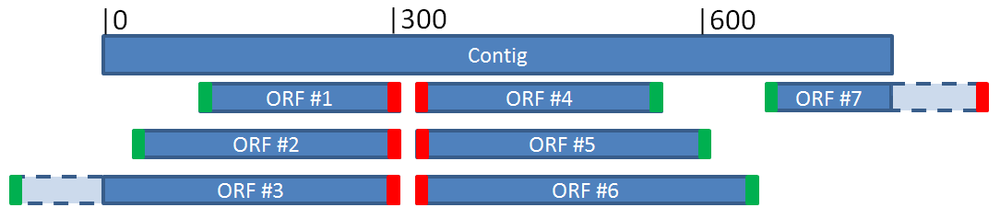

# Genotate.jar: a platform for the annotation of transcript sequences

# Table of Contents

1. [Introduction](#Introduction)
2. [Installation requirements](#Installation)
3. [Installation of Genotate](#Installation)
4. [Usage of Genotate](#Genotate)
5. [Structure of the annotation results](#Output)

# <a name="Introduction"> 1. Introduction</a>

The Genotate platform allows the automatic annotation and exploration of transcript sequences.

The Genotate platform is composed of a Java standalone application (Genotate.jar) and web platform (Genotate.life).

Transcript annotations can be predicted based on sequence homology and structural analyses at both the transcript and amino acid levels. Thanks to the Genotate web plaform, identified annotations can be easily visualized using interactive viewers. Furthermore, users can search for transcripts having specific features among their annotation results.


Genotate is available at [https://genotate.life](https://genotate.life) and this README explains how to install the Genotate.jar standalone application on a local private servers for users willing to customize it.


## Identification of ORF

For each transcript to analyze, Genotate first detects the sets of all possible ORFs based on parameters selected in the ORF panel. ORFs are then translated to obtain the associated protein sequences. The start and stop codons (which initiate and end the ORFs) can be specified by users. By default, start codon is set to 'ATG' and stop codons to 'TAG, TGA, and TAA'. ORFs with a length lower than a threshold can be filtered to avoid interpretations of sequences with no biological meaning. Inner ORFs (which consist of nested ORF sequences) can also be identified as well as outside ORF (which consist of ORFs lacking either the start or stop codon). By default, the complete transcript sequence is conserved to be annotated as a non-coding RNA. By default, ORFs are also identified on the reverse complemented transcript sequence.

In detail, the protein associated to a transcript are obtained by detecting all the possible ORF on the transcript. A frame is composed of nucleotide triplets called codon. The transcript sequence is divided into three frames, with a shift of one base on the sequence strand. The transcript sequence can also be reversed, and the nucleic base complemented to obtain the complementary sequence. An Open Reading Frame begins with a codon start and ends with a codon stop. A codon can be translated to an amino acid or end of translation signal. A codon encoding the beginning of the translation, such as 'ATG', is called codon start. A codon encoding the end of the translation, such as 'TAG, TGA, TAA', is called codon stop. A protein is obtained from the translated sequence of an Open Reading Frame.

The following figure represents different possible ORFs.



ORF 2 and 6 are complete ORF which includes the inner ORF 1, 4  and 5. The ORF 3 and 7 are incomplete and characterized as outside ORF.

## Identification of homology annotations

Homology annotations are computed based on 290 reference datasets of transcriptomic or proteomic sequences obtained from Ensembl, UniRef, and NONCODE databases. Sequences homologies are identified using the BLAST algorithm. Homology annotation results can be filtered based on the percentage identity match, the percentage of query sequence coverage, and the percentage of reference sequence coverage. The meta-information associated with the matched sequences (i.e., the sequence id, description, function, and properties) are available in the homology annotation results.

<table>
  <tr style="font–weight: bold;">
    <td style="width:10%">Name</sub></td>
    <td style="width:70%">Information</sub></td>
    <td style="width:10%">Link</sub></td>
    <td style="width:10%">Reference</sub></td>
  </tr>
  <tr>
    <td><sub>Ensembl</sub></td>
    <td><sub>Transcriptome (cds, cdna, ncrna) and proteome reference for a large number of species</sub></td>
    <td><sub><a href='http://www.ensembl.org/index.html'>Link</a><sub></td>
    <td><sub>[10]</sub></td>
  </tr>
  <tr>
    <td><sub>UniRef</sub></td>
    <td><sub>UniRef contains high quality computationally analyzed records that are enriched with automatic annotation and classification.</sub></td>
    <td><sub><a href='http://www.uniprot.org/downloads'>Link</a><sub></td>
    <td><sub>[11]</sub></td>
  </tr>
  <tr>
    <td><sub>NONCODE</sub></td>
    <td><sub>NONCODE is dedicated to non-coding RNAs (excluding tRNAs and rRNAs) for multiple species</sub></td>
    <td><sub><a href='http://www.noncode.org/'>Link</a><sub></td>
    <td><sub>[12]</sub></td>
  </tr>
</table>

## Identification of functional annotations

Functional annotations are computed based on a compendium of 26 publicly available computational tools and databases specified by the user. Especially, we use the InterproScan software to find functional domains in the translated protein sequences of the reconstructed transcripts. Indeed, InterproScan unifies protein functional domains from different databases.


<table>
  <tr style="font–weight: bold;">
    <td style="width:10%">Name</sub></td>
    <td style="width:35%">Information</sub></td>
    <td style="width:35%">Institute</sub></td>
    <td style="width:10%">Link</sub></td>
  </tr>
  <tr>
    <td><sub>Interproscan</sub></td>
    <td><sub>Standalone which unify protein analysis tool and databases</sub></td>
    <td><sub>EMBL–EBI in Hinxton, The Wellcome Genome Campus</sub></td>
    <td><sub><a href='https://github.com/ebi–pf–team/interproscan'>Link</a><sub></td>
  </tr>
  <tr>
    <td><sub>Cdd</sub></td>
    <td><sub>Search Conserved Domains and Protein Classification</sub></td>
    <td><sub>The National Center for Biotechnology Information (NCBI) is part of the United States National Library of Medicine (NLM), a branch of the National Institutes of Health.</sub></td>
    <td><sub><a href='https://www.ncbi.nlm.nih.gov/cdd/'>Link</a><sub></td>
  </tr>
  <tr>
    <td><sub>Gene3d</sub></td>
    <td><sub>Search CATH domain families from PDB structures</sub></td>
    <td><sub>UCL Department of Biochemical Engineering. University College, London, UK.</sub></td>
    <td><sub><a href='http://gene3d.biochem.ucl.ac.uk/'>Link</a><sub></td>
  </tr>
  <tr>
    <td><sub>Hamap</sub></td>
    <td><sub>classification and annotation system of protein sequences</sub></td>
    <td><sub>SIB Swiss Institute of Bioinformatics</sub></td>
    <td><sub><a href='http://hamap.expasy.org/'>Link</a><sub></td>
  </tr>
  <tr>
    <td><sub>Panther</sub></td>
    <td><sub>Gene ontology classification system</sub></td>
    <td><sub>University of Southern California, CA, US.</sub></td>
    <td><sub><a href='http://www.pantherdb.org/'>Link</a><sub></td>
  </tr>
  <tr>
    <td><sub>Pfam</sub></td>
    <td><sub>Search protein families from Pfam database</sub></td>
    <td><sub>EMBL European Bioinformatics Institute</sub></td>
    <td><sub><a href='http://pfam.xfam.org/'>Link</a><sub></td>
  </tr>
  <tr>
    <td><sub>Pirsf</sub></td>
    <td><sub>Search against fully curated PIRSF families with HMM models</sub></td>
    <td><sub>Georgetown University Medical Center, University of Delaware</sub></td>
    <td><sub><a href='http://pir.georgetown.edu/pirwww/search/pirsfscan.shtml'>Link</a><sub></td>
  </tr>
  <tr>
    <td><sub>Prints</sub></td>
    <td><sub>Search protein fingerprints</sub></td>
    <td><sub>University of Manchester, UK.</sub></td>
    <td><sub><a href='http://130.88.97.239/PRINTS/index.php'>Link</a><sub></td>
  </tr>
  <tr>
    <td><sub>Prodom</sub></td>
    <td><sub>Search protein domain</sub></td>
    <td><sub>PRABI Villeurbanne, France.</sub></td>
    <td><sub><a href='http://prodom.prabi.fr/prodom/current/html/home.php'>Link</a><sub></td>
  </tr>
  <tr>
    <td><sub>Prosite</sub></td>
    <td><sub>Search protein families and domains</sub></td>
    <td><sub>Swiss Institute of Bioinformatics (SIB), Geneva, Switzerland.</sub></td>
    <td><sub><a href='http://prosite.expasy.org/'>Link</a><sub></td>
  </tr>
  <tr>
    <td><sub>Sfld</sub></td>
    <td><sub>Search enzymes classification in the Structure–Function Linkage Database</sub></td>
    <td><sub>UC San Francisco, Babbitt Lab, SFLD Team</sub></td>
    <td><sub><a href='http://sfld.rbvi.ucsf.edu/django/web/networks/'>Link</a><sub></td>
  </tr>
  <tr>
    <td><sub>Smart</sub></td>
    <td><sub>Simple Modular Architecture Research Tool</sub></td>
    <td><sub>EMBL, Heidelberg, Germany.</sub></td>
    <td><sub><a href='http://smart.embl–heidelberg.de/'>Link</a><sub></td>
  </tr>
  <tr>
    <td><sub>Superfamily</sub></td>
    <td><sub>structural and functional annotation for proteins and genomes</sub></td>
    <td><sub>University of Bristol, UK.</sub></td>
    <td><sub><a href='http://supfam.org/SUPERFAMILY/'>Link</a><sub></td>
  </tr>
  <tr>
    <td><sub>Tigrfam</sub></td>
    <td><sub>identify functionally related proteins based on sequence homology</sub></td>
    <td><sub>J. Craig Venter Institute, Rockville, MD, US.</sub></td>
    <td><sub><a href='http://www.jcvi.org/cgi–bin/tigrfams/index.cgi'>Link</a><sub></td>
  </tr>
  <tr>
    <td><sub>Tmhmm</sub></td>
    <td><sub>predicts of transmembrane helices in proteins</sub></td>
    <td rowspan=3><sub>Center for Biological Sequence Analysis at the Technical University of Denmark</sub></td>
    <td><sub><a href='http://www.cbs.dtu.dk/services/TMHMM/'>Link</a><sub></td>
  </tr>
  <tr>
    <td><sub>Signalp</sub></td>
    <td><sub>predicts the presence and location of signal peptide cleavage sites in amino acid sequences</sub></td>
    <td><sub><a href='http://www.cbs.dtu.dk/services/SignalP/'>Link</a><sub></td>
  </tr>
  <tr>
    <td><sub>Prop</sub></td>
    <td><sub>predicts arginine and lysine propeptide cleavage sites</sub></td>
    <td><sub><a href='http://www.cbs.dtu.dk/services/ProP/'>Link</a><sub></td>
  </tr>
  <tr>
    <td><sub>Coils</sub></td>
    <td><sub>Predicts coiled–coil conformation</sub></td>
    <td><sub>SIB Swiss Institute of Bioinformatics</sub></td>
    <td><sub><a href='http://embnet.vital–it.ch/software/COILS_form.html'>Link</a><sub></td>
  </tr>
  <tr>
    <td><sub>Mobidblite</sub></td>
    <td><sub>predictions of long intrinsically disordered regions</sub></td>
    <td><sub>Department of Biomedical Sciences, University of Padua</sub></td>
    <td><sub><a href='http://protein.bio.unipd.it/mobidblite/'>Link</a><sub></td>
  </tr>
</table>

# <a name="Installation"> 2. Installation requirements</a>
## Installation of Java

Java can be downloaded on the [java.com website](https://www.java.com/fr/download/linux_manual.jsp).

Please install the Java interpreter in the 'services/java/bin/java' folder.

## Installation of BLAST
The BLAST algorithm is used to identify sequences homologies. 

BLAST can be downloaded on the [NCBI website](https://blast.ncbi.nlm.nih.gov/Blast.cgi?PAGE_TYPE=BlastDocs&DOC_TYPE=Download) and installed using the following commands:

```
wget ftp://ftp.ncbi.nlm.nih.gov/blast/executables/blast+/LATEST/ncbi–blast–2.6.0+–x64–linux.tar.gz
tar –pxvzf ncbi–blast–2.6.0+–x64–linux.tar.gz
mv ncbi–blast–2.6.0+ blast
```

## Installation of InterProScan
InterproScan unifies protein functional domains from different databases, such as Pfam, SUPERFAMILY, and PANTHER.

InterProScan can be downloaded on the [interproscan github](https://github.com/ebi–pf–team/interproscan/wiki/HowToDownload) and installed using the following commands:

```
wget ftp://ftp.ebi.ac.uk/pub/software/unix/iprscan/5/5.22–61.0/interproscan–5.22–61.0–64–bit.tar.gz
tar –pxvzf interproscan–5.22–61.0–64–bit.tar.gz
mv interproscan–5.22–61.0 interproscan
```

To install Panther, please download the latest Panther data file (~ 12 GB). The data file need to be extracted into the '[InterProScan5 home]/data/' folder.

```
wget ftp://ftp.ebi.ac.uk/pub/software/unix/iprscan/5/data/panther–data–11.1.tar.gz
wget ftp://ftp.ebi.ac.uk/pub/software/unix/iprscan/5/data/panther–data–11.1.tar.gz.md5
md5sum –c panther–data–11.1.tar.gz.md5
tar –pxvzf panther–data–11.1.tar.gz
```

The full path of the Java interpreter must be defined in the bash environment or directly in the 'interproscan.sh' script
```
JAVA=/var/www/genotate/services/java/bin/java
```

You can edit the 'interproscan.properties' file to change the number of parallel jobs allowed for interproscan and interproscan workers.
At least one worker is required, which can launch other workers.
```
number.of.embedded.workers=1
maxnumber.of.embedded.workers=32
worker.number.of.embedded.workers=4
worker.maxnumber.of.embedded.workers=4
```

## Installation of ProP
ProP predicts arginine and lysine propeptides that can be removed to activate the protein. 

ProP can be downloaded on the [CBS website](http://www.cbs.dtu.dk/cgi–bin/nph–sw_request?prop).

A tcsh interpreter is required to run ProP which can be installed using the following command:
```
apt–get install tcsh
```

The prop script needs to be edited to specifiy the full path to the 'prop' folder.
```
setenv PROPHOME /var/www/genotate/services/prop
```

## Installation of TMHMM
TMHMM predicts transmembrane domains that are found in proteins usually involved in transport or signaling.

TMHMM can be downloaded on the [CBS website](http://www.cbs.dtu.dk/cgi–bin/nph–sw_request?tmhmm).

The tmhmm script needs to be edited to specifiy the full path to tmhmm folder.
```
$opt_basedir = "/var/www/genotate/services/tmhmm/";
```
Please check that the path to the perl interpreter (/usr/bin/perl or /usr/local/bin/perl) are well specified in the 'tmhmm/bin/tmhmm' and 'tmhmm/bin/tmhmmformat.pl' files.


## Installation of SignalP
SignalP predicts secretory signal peptides that correspond to markers for translocation of the protein across the membrane.

SignalP can be downloaded on the [CBS website](http://www.cbs.dtu.dk/cgi–bin/nph–sw_request?signalp).

The signalp script needs to be edited to specifiy the full path to the signalP folder.
```
$ENV{SIGNALP} = '/var/www/genotate/services/signalp';
```

## Installation of NetCGlyc 
NetNglyc predicts N-Glycosylation sites that correspond to the attachment of glycans in the N-terminal part of the protein. 

NetCGlyc  and is available on the [CBS website](http://www.cbs.dtu.dk/).

The script that launch NetCGlyc  needs to be edited to specifiy the full path to the installation directory.

## Installation of BepiPred
BepiPred predicts B-cell epitopes that are antibodies recognized in response to infectious pathogens.

BepiPred is available on the [CBS website](http://www.cbs.dtu.dk/).

The script that launch BepiPred need to be edited to specifiy the full path to the installation directory.

## Installation of NetMHCpan-I
NetMHCpan-I predicts peptides that bind the Major Histocompatibility Complex (MHC) class I that are involved in recognition of pathogens by the cellular immune system. 

NetMHCpan-I is available on the [IEDB website](http://tools.iedb.org/) and can be installed using the following commands:

```
wget http://media.iedb.org/tools/mhci/latest/IEDB_MHC_I–2.15.4.tar.gz
cd mhc_i
./configure
#if error ImportError: No module named pkg_resources
#sudo apt–get install ––reinstall python–pkg–resources
```

A configuration script is available in the tool directory.

After installation, remove the line waiting for input in the predict_binding.py script as the following:

```
#if not sys.stdin.isatty():
#    stdin = sys.stdin.readline().strip()
#    args.append(stdin)
```

## Installation of NetMHCpan-II
NetMHCpan-II predicts peptides that bind the Major Histocompatibility Complex (MHC) class II that are involved in recognition of pathogens by the cellular immune system.

NetMHCpan-II is available on the [IEDB website](http://tools.iedb.org/) and can be installed using the following commands:

```
apt–get install gawk
wget http://media.iedb.org/tools/mhcii/latest/IEDB_MHC_II–2.16.2.tar.gz
cd mhc_ii
./configure.py
#if error ImportError: No module named pkg_resources
#sudo apt–get install ––reinstall python–pkg–resources
```

A configuration script is available in the tool directory.

After installation, remove the line waiting for input in the predict_binding.py script as the following:

```
#if not sys.stdin.isatty():
#    stdin = sys.stdin.readline().strip()
#    sys.argv.append(stdin)
```

## Installation of rnammer
RNAmmer annotates ribosomal RNA genes. 

RNAmmer can be installed using the following commands:
```
wget http://eddylab.org/software/hmmer/2.3/hmmer-2.3.tar.gz
cd hmmer-2.3
cpan install Getopt::Long
./configure
make
make check
make install

mkdir rnammer
wget [rnammer link from CBS]
tar -xzvf rnammer.tar.Z
libxml-parser-perl
cpan install XML::Simple
edit rnammer paths
edit core-rnammer remove --cpu 1
```

## Installation of tRNAscan
tRNAScanSE predicts transfer RNA genes.

tRNAscan SE can be installed using the following commands:
```
wget http://lowelab.ucsc.edu/software/tRNAscan-SE.tar.gz
tar -zxvf tRNAscan-SE.tar.gz
mv tRNAscan-SE-1.3.1 tRNAscan-SE
cd tRNAscan-SE
edit makefile paths
make
make install
```


## Configuration of execution authorization
Please check that annotation algorithms and software can be correctly executed.

The following files and folders shoul be executable:
 * Java executables in jdk/bin and jdk/jre/bin
 * BLAST executables in blast/bin
 * ProP executables in prop/bin and prop/how and the prop script 
 * TMHMM executables in tmhmm/bin and the tmhmm script 
 * SignalP executables in signalP/bin and the signalp script 

# <a name="Usage"> 3. Installation of Genotate</a>

Genotate can be downloaded using the following command:

```
wget https://github.com/tchitchek–lab/genotate.jar/blob/master/binaries/genotate.jar
```

Genotate requires a configuration file (specifiying the paths to all programs and databases used for the annotation analyses). Please ensure that the 'genotate.config' file is well in genotate.jar folder.

Below you can found an example for the configuration file, available in github.
```
BLAST:/var/www/genotate/services/blast/bin
BLASTALL:/var/www/genotate/services/interproscan/bin/blast/2.2.24/bin
JAVA:/var/www/genotate/services/jdk/jre/bin/java
INTERPROSCAN:/var/www/genotate/services/interproscan/interproscan.sh
LIPOP:/var/www/genotate/services/lipop/LipoP
PROP:/var/www/genotate/services/prop/prop
SIGNALP:/var/www/genotate/services/signalp/signalp
TMHMM:/var/www/genotate/services/tmhmm/tmhmm
```

# <a name="Genotate"> 4. Usage of Genotate</a>

Genotate can be executed with the following command:

```
java –jar genotate.jar –input example.fasta –output test –services TMHMM
```

Multiple options are available:
```
-input                         Input nucleic fasta file path
-output                        Output folder path
-services                      Services to run
-services_messages             Display the services messages
-inner_orf                     Allows orf contained in larger ones
-outside_orf                   Allows partial orf lacking either a codon stop or a codon start
-orf_min_size      100         Filter orf to keep only those long enough. The size is in nucleic bases
-region_by_run     100         Number of region computed together
-refresh_time      10          Waiting time in seconds between each results check
-threads           8           Number of jobs computed at the same time
-start_codon       ATG         Start codon(s) used to search for orf
-stop_codon        TAG,TGA,TAA Stop codon(s) used to search for orf
-ignore_reverse                Do not compute the annotation on the reverse strand
-ignore_ncrna                  Do not compute the annotation of ncrna
```

Multiple annotation services and databases are available. For each annotation service, a threshold score is available to control the quality of the annotations:
```
BLASTN          [database,identity,query cover,subject cover] by default 85,50,50 (min 0 to max 100)
BLASTP          [database,identity,query cover,subject cover] by default 85,50,50 (min 0 to max 100)
BEPIPRED        [score]  by default threshold = 0.5 (min 0 to max 1)
MHCI            [score]  by default threshold = 1   (min 0 to max 2)
MHCII           [score]  by default threshold = 1   (min 0 to max 2)
NETCGLYC        [score]  by default threshold = 0.5 (min 0 to max 1)
NETNGLYC        [score]  by default threshold = 0.5 (min 0 to max 1)
PROP            [score]  by default threshold = 0.2 (min 0 to max 1)
SABLE           [score]  by default threshold = 5   (min 3 to max 9)
SIGNALP         [score]  by default threshold = 0.45(min 0 to max 1)
CDD             [evalue] by default evalue = 0.05 (min 0 to max 1)
COILS           [evalue] by default evalue = 0.05 (min 0 to max 1)
GENE3D          [evalue] by default evalue = 0.05 (min 0 to max 1)
HAMAP           [evalue] by default evalue = 0.05 (min 0 to max 1)
MOBIDBLITE      [evalue] by default evalue = 0.05 (min 0 to max 1)
PANTHER         [evalue] by default evalue = 0.05 (min 0 to max 1)
PFAM            [evalue] by default evalue = 0.05 (min 0 to max 1)
PIRSF           [evalue] by default evalue = 0.05 (min 0 to max 1)
PRIAM           [evalue] by default evalue = 0.05 (min 0 to max 1)
PRINTS          [evalue] by default evalue = 0.05 (min 0 to max 1)
PRODOM          [evalue] by default evalue = 0.05 (min 0 to max 1)
PROSITEPATTERNS [evalue] by default evalue = 0.05 (min 0 to max 1)
PROSITEPROFILES [evalue] by default evalue = 0.05 (min 0 to max 1)
SFLD            [evalue] by default evalue = 0.05 (min 0 to max 1)
SMART           [evalue] by default evalue = 0.05 (min 0 to max 1)
SUPERFAMILY     [evalue] by default evalue = 0.05 (min 0 to max 1)
TIGRFAM         [evalue] by default evalue = 0.05 (min 0 to max 1)
TMHMM           no scores availables
```

# <a name="Output"> 5. Structure of the annotation results</a>

Genotate provides the annotation results in multiple results files.

The 'transcript.fasta' file contains all the input transcript sequences.  The structure of this file is defined as:
```
>ID1 Description
ATGGGGCCCGGGCCCGGGCCCGGGCCCGGGCCCGGGCCCGGGCCC
CCCGGGCCCGGGCCCGGGCCCGGGCCCGGGCCCGGGCCCGGGCCC
CCCGGGCCCGGGCCCGGGCCCGGGCCCGGGCCCGGGCCCGGGTAA
>ID2 Description
ATGGGGCCCGGGCCCGGGCCCGGGCCCGGGCCCGGGCCCGGGCCC
CCCGGGCCCGGGCCCGGGCCCGGGCCCGGGCCCGGGCCCGGGCCC
CCCGGGCCCGGGCCCGGGCCCGGGCCCGGGCCCGGGCCCGGGTAA
>ID3 Description
NNNNNNNNNNNNNNNNNNNNNNNNNNNNNNNNNNNNNNNNNNNNN
NNNNNNNNNNNNNNNNNNNNNNNNNNNNNNNNNNNNNNNNNNNNN
NNNNNNNNNNNNNNNNNNNNNNNNNNNNNNNNNNNNNNNNNNNNN
```

The 'transcript_clean.fasta' file contains the transcript sequences keep for the annotation analysis. The structure of this file is defined as:

```
>ID1 Description
ATGGGGCCCGGGCCCGGGCCCGGGCCCGGGCCCGGGCCCGGGCCC
CCCGGGCCCGGGCCCGGGCCCGGGCCCGGGCCCGGGCCCGGGCCC
CCCGGGCCCGGGCCCGGGCCCGGGCCCGGGCCCGGGCCCGGGTAA
>ID2 Description
ATGGGGCCCGGGCCCGGGCCCGGGCCCGGGCCCGGGCCCGGGCCC
CCCGGGCCCGGGCCCGGGCCCGGGCCCGGGCCCGGGCCCGGGCCC
CCCGGGCCCGGGCCCGGGCCCGGGCCCGGGCCCGGGCCCGGGTAA
```

The 'transcript_info.tab' file contains the description associated to each transcript sequence. The structure of this file is defined as:
```
transcript_id       transcript_name     transcript_desc                                                                        transcript_size
0               AL049998.1      Homo sapiens mRNA; cDNA DKFZp564L222 Phosphatidylinositol–4–phosphate 3–kinase     1304
1               NM_002645.3     Homo sapiens phosphatidylinositol–4–phosphate 3–kinase, mRNA                       2936
```

The 'region_nucl.fasta' file contains the coding and noncoding nucleic sequences. The 'region_prot.fasta' file contains the translated protein sequences of the coding regions. The structure of this file is defined as:

```
>Region1 Description
ATGGGGCCCGGGCCCGGGCCCGGGCCCGGGCCCGGGCCCGGGCCC
CCCGGGCCCGGGCCCGGGCCCGGGCCCGGGCCCGGGCCCGGGCCC
CCCGGGCCCGGGCCCGGGCCCGGGCCCGGGCCCGGGCCCGGGTAA
>Region2 Description
ATGGGGCCCGGGCCCGGGCCCGGGCCCGGGCCCGGGCCCGGGCCC
CCCGGGCCCGGGCCCGGGCCCGGGCCCGGGCCCGGGCCCGGGCCC
CCCGGGCCCGGGCCCGGGCCCGGGCCCGGGCCCGGGCCCGGGTAA
```

The 'region_info.tab' file contains the information associated to each region. The structure of this file is defined as:
```
region_id  begin        end     size            strand        coding      type        transcript_id
0       423             609     186             +             coding                  0
1       669             888     219             +             coding                  0
2       294             423     129             +             coding                  0
3       717             834     117             +             coding                  0
4       249             351     102             +             coding                  1
5       213             2919    2706            +             coding                  1
6       666             774     108             +             coding                  1
7       2169            2340    171             +             coding                  1
8       966             1230    264             –             coding                  1
```

The 'all_annotations.tab' file contains all the identified annotations. The structure of this file is defined as:
```
region_id  service begin   end     name                       description
10         TMHMM   3       114     outside
10         PROP    27      54      cleavage site: VSGSVKRGV
9          TMHMM   3       120     inside
8          TMHMM   3       261     inside
7          TMHMM   3       168     outside
6          TMHMM   3       105     outside
5          TMHMM   3       2703    outside
5          CDD     2031    2547    cd04012 C2A_PI3K_class_II
4          TMHMM   3       99      inside
4          PROP    33      60      cleavage site: KRCGQRRSI
```

For each region, an SVG graph is generated to visualize the annotations on the transcript sequences:


	